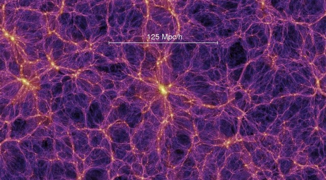

# DARK MATTER(S)

A project about something you can't see but exists. Discover the invisible.


---
###### TEAM MEMBERS

Lea Fabiano, Elena Filippi, Serena Milesi, Jacopo Perico

---
###### COURSE REFERENCES AND ACADEMIC YEAR

[Creative Coding 2018/2019](https://drawwithcode.github.io/2018/)<br>
Politecnico di Milano - Scuola del Design<br>
Faculty: Michele Mauri, Tommaso Elli

---
###### ABOUT THE PROJECT

**Our project is about the discover of Dark Matter.** <br>
What’s Dark Matter? We don’t know, we only have been exposed to **theories**. But the main point of this project is to show that actually it is still something unknown. Dark matter is something that **permeate the universe**, but remains unseen and hard to define. It does not reflect the light, so we are not able to detect it with our instruments. Qua aggiungerei: l'unico motivo per cui si conosce è per gli effetti che ha su alcuni elementi dell'universo.

**But how the scientists discovered the presence of Dark Matter?**<br>
Back in the XV Century doc. **Kepler** figured out that the farther a planet is from the sun slower it orbits. This was valid also for galaxies. It became one of his very important **"three laws of planetary motion"**. Moreover he was able to calculate the gravity of a celestial bodies and finally get their mass.

<p align="center"> </p>
<p align="center">
    <em style="font-size:10pt">image_caption</em>
</p>


Many years after scientist **Vera Rubin** observed that in many galaxies, the farer out from the center you went the faster the gas clouds were moving. Furthermore there was not enough mass far out from the center to influence and cause the rapid rotation rates. That was bizarre. So she came to the conclusion that the stars out were feeling the **gravitational effects of matter that we do not see**: the dark matter. This material was contributing to the gravity, something beside stars, gas and dust and she actually demonstrated there is a lot of it if we consider all the universe.

Scientists nowadays define “dark matter” a hypothetical component of matter that, unlike known matter, would not emit electromagnetic radiation and would currently be detectable only indirectly through its gravitational effects. The dark matter should constitute almost the 90% of the present mass in the universe. They were able also to define other theories to demostrate the presence of this anti-materia:

- The theory of **galaxy rotation** (the speed of rotation should decrease with the increase in the diameter of the orbit and instead remains constant)
- The theory of **gravitational lens** (the visible mass is insufficient to create a gravitational lens capable of deflecting light)
- The theory of **light deviation** (following a scientific observation it was found that the light is also diverted in areas where the masses were not visible)

Understanding dark matter is **important to understand the size, shape and future of the universe.** The amount of dark matter in the universe will determine if the universe is open (continues to expand), closed (expands to a point and then collapses) or flat (expands and then stops when it reaches equilibrium).<br>
Understanding dark matter will also aid in definitively explaining the formation and evolution of galaxies and clusters. As a galaxy spins it should be torn apart. This does not happen thanks to gravitational force; but the amount of gravity required to do this, however, is enormous and could not be generated only by the visible matter in the galaxy.

With this project we would like to make the user live the challenge born from the observation of sensitive reality (which escapes some laws of physics studied) and that through several demonstrations has led man to ask himself a question: **is there something that we can not know, see and experience?** And if so, **what form has it?** (which represents a bit the direction in which many researches are moving).

---
###### DESIGN CHALLENGES

Initially, we though it could be interesting to show how things should work in space according to Kepler's discoveries: this would help the user to familiarize with physics concepts about celestial bodies and the rules that control the universe.

#### Website experience <span style="font-size:28pt">💅🏼</span>

In order to do so we divided the experience in three different steps:

**Step #1**<br>
The user is taken to a tutorial section, the very beginning of this experience. In this part he can buld his own small solar system and discover how planets and satellites rotate around a big star at the center of the system. The console at the right of the screen gives you all the instructions and explanations you need. While creating your own solar system, the third Kepler's law is explained.

You can create your system of planets and satellites just by ```onClick()``` clicking the mouse and by ```mousePressed()```keeping it pressed to create elements with different dimensions.

**Step #2**<br>
The second step allows you to "upload you solar system" into the galaxy and see what actually happens in realty; you can do this by ```keyPressed()```holding the spacebar.

**Step #3**<br>
Now everything is moving faster, but why? The instructions say to cover the camera to see what's happening. When you cover it, the dark matter is revealed in the background of your planes system. This revelation is led also by the text that shows you the speed and mass increment.

#### Visual design

For the visuals we wanted to keep everything as clear and simple as possible. Black and white colours, with basic shapes and very clean sketch, in order to make him notice even the smallest changes. Since dark matter is something we cannot see and so it as no form, and probably permeate all the universe.

<div align="center">
    
    
    
</div>
<p align="center">
    <em style="font-size:10pt">Different visualizations on how the scientists represent the dark matter</em>
</p>

Looking at different images the scientist use to represent dark matter we immediatly tought that the *perlin noise* effet was the best solution to visualize the element. But since we were not sure about the final effect among our synthesized elements we though that the creation of something with no form, and distributed in all of the sketch was a better alternative.

<div align="center" height="50px">
    
</div>
<p align="center">
    <em style="font-size:10pt">Exemple of the fluid effect we wanted to reproduce</em>
</p>

In contrast with this, all the other elements in the canvas are regular and defined shapes.

#### Innovative ideas

1. Planets float with a different velocity once you go to the
2. The idea to have a console element in the
3. Invert colours and covering the webcam: The interaction with the camera is seen as an oxymoron because the users as to cover the camera to discover the dark matter.

---
###### CODE CHANGELLES

#### Basic canvasses structure
P: One of first problems we had was trying to figure out how to build the basic structure of the website. This is because we had many

S: We decided to use the *html* language and *css* attributes to create a new template for the canvas and the text in order to link the .js animation we needed for the "console effect". Every paragraph now is insered into a ```<span>``` tag.

```html
<!--
    Paragraph <span> structure
-->
<span style="">This is a paragraph</span>

```

#### Dark Matter animation
P:

S: We created an ```ìnterator``` as a variable and created a ```for```cicle to call the animation for each span.
We took inspiration from [this](https://codepen.io/dtab428/pen/eWVOOy) animation and [this](https://web.archive.org/web/20180804022116/http://leonardo-angelucci.ch/).


#### Text flipping animation
P: We didn't know how to reproduce the flipping animation we wanted to add to the instructions on the console.The idea was to give this kind of "creation animation", but to call the function only one paragraph at the time.

S: We created an ```ìnterator``` as a variable and created a ```for```cicle to call the animation for each span.
We took inspiration from [this](https://codepen.io/dtab428/pen/eWVOOy) animation and [this](https://web.archive.org/web/20180804022116/http://leonardo-angelucci.ch/).

```js
function easy

```


---
###### INSPIRATION AND REFERENCES

-
