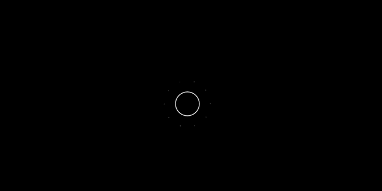

# DARK MATTER(S)

A project about something you can't see but exists. Discover the invisible.


---
###### TEAM MEMBERS

Lea Fabiano, Elena Filippi, Serena Milesi, Jacopo Perico

---
###### COURSE REFERENCES AND ACADEMIC YEAR

[Creative Coding 2018/2019](https://drawwithcode.github.io/2018/)<br>
Politecnico di Milano - Scuola del Design<br>
Faculty: Michele Mauri, Tommaso Elli

---
###### ABOUT THE PROJECT

**Our project is about the discover of Dark Matter.** <br>
What’s Dark Matter? We don’t know, we only have been exposed to **theories**. But the main point of this project is to show that actually it is still something unknown. Dark matter is something that **permeate the universe**, but remains unseen and hard to define. It does not reflect the light, so we are not able to detect it with our instruments. The only reasons why scientists believe dark matter exists is because of its effects on the other matter in the universe.

**But how the scientists discovered the presence of Dark Matter?**<br>
Back in the XV Century doc. **Kepler** figured out that the farther a planet is from the sun slower it orbits. This was valid also for galaxies. It became one of his very important **"three laws of planetary motion"**. Moreover he was able to calculate the gravity of a celestial bodies and finally get their mass.

<p align="center"> </p>
<p align="center">
    <em >image_caption</em>
</p>


Many years after scientist **Vera Rubin** observed that in many galaxies, the farer out from the center you went the faster the gas clouds were moving. Furthermore there was not enough mass far out from the center to influence and cause the rapid rotation rates. That was bizarre. So she came to the conclusion that the stars out were feeling the **gravitational effects of matter that we do not see**: the dark matter. This material was contributing to the gravity, something beside stars, gas and dust and she actually demonstrated there is a lot of it if we consider all the universe.

Scientists nowadays define “dark matter” a hypothetical component of matter that, unlike known matter, would not emit electromagnetic radiation and would currently be detectable only indirectly through its gravitational effects. The dark matter should constitute almost the 90% of the present mass in the universe. They were able also to define other theories to demostrate the presence of this anti-materia:

- The theory of **galaxy rotation** (the speed of rotation should decrease with the increase in the diameter of the orbit and instead remains constant)
- The theory of **gravitational lens** (the visible mass is insufficient to create a gravitational lens capable of deflecting light)
- The theory of **light deviation** (following a scientific observation it was found that the light is also diverted in areas where the masses were not visible)

Understanding dark matter is **important to understand the size, shape and future of the universe.** The amount of dark matter in the universe will determine if the universe is open (continues to expand), closed (expands to a point and then collapses) or flat (expands and then stops when it reaches equilibrium).<br>
Understanding dark matter will also aid in definitively explaining the formation and evolution of galaxies and clusters. As a galaxy spins it should be torn apart. This does not happen thanks to gravitational force; but the amount of gravity required to do this, however, is enormous and could not be generated only by the visible matter in the galaxy.

With this project we would like to make the user live the challenge born from the observation of sensitive reality (which escapes some laws of physics studied) and that through several demonstrations has led man to ask himself a question: **is there something that we can not know, see and experience?** And if so, **what form has it?** (which represents a bit the direction in which many researches are moving).

---
###### DESIGN CHALLENGES

Initially, we though it could be interesting to show how things should work in space according to Kepler's discoveries: this would help the user to familiarize with physics concepts about celestial bodies and the rules that control the universe.

#### Website experience

In order to do so we divided the experience in three different steps:

**Step #1**<br>
The user is taken to a tutorial section, the very beginning of this experience. In this part he can buld his own small solar system and discover how planets and satellites rotate around a big star at the center of the system. The console at the right of the screen gives you all the instructions and explanations you need. While creating your own solar system, the third Kepler's law is explained.

You can create your system of planets and satellites just by ```onClick()``` clicking the mouse and by ```mousePressed()```keeping it pressed to create elements with different dimensions.

**Step #2**<br>
The second step allows you to "upload you solar system" into the galaxy and see what actually happens in realty; you can do this by ```keyPressed()```holding the spacebar.

**Step #3**<br>
Now everything is moving faster, but why? The instructions say to cover the camera to see what's happening. When you cover it, the dark matter is revealed in the background of your planes system. The concept is also explained and demostrated by the data at the bottom of the "console", which are about the average velocity and the total mass of the system.


#### Visual design

For the visuals we wanted to keep everything as clear and simple as possible. Black and white colours, with basic shapes and very clean sketch, in order to make him notice even the smallest changes.

We wanted to recreate the terminal aesthetics, so we used the LawnGreen color for the text.
<p align="center"></p>

 Since dark matter is something we cannot see and so it as no form, and probably permeate all the universe.

<div align="center">
    
    
    
</div>
<p align="center">
    <em >Different visualizations on how the scientists represent the dark matter</em>
</p>

Looking at different images the scientist use to represent dark matter we immediatly tought that the *perlin noise* effet was the best solution to visualize the element. But since we were not sure about the final effect among our synthesized elements we though that the creation of something with no form, and distributed in all of the sketch was a better alternative.

<div align="center" height="50px">
    
</div>
<p align="center">
    <em>Exemple of the fluid effect we wanted to reproduce</em>
</p>

In contrast with this, all the other elements in the canvas are regular and defined shapes.

#### Project's design features

1. A very important part of the project is the general feedback, both visual and interactive, to the user: for example, when he creates planets he is able to actually have a live preview of what is happening on the screen: everything is very responsive.

<div align="center">
    
</div>
<p align="center">
    <em>Preview of the dimension of the planet the user is about to drop</em>
</p>

2. The planets fluctuate at different speeds once the users planetary system is loaded into the galaxy. The speed increase  starts when the spacebar is pressed and increases incrementally until the loading is successful. If the user releases the key, the speed decreases until it returns to that before the action. The action of pressing the spacebar is another visual feedback value, especially when a loading bar appears. In addition, the speed increase is also displayed in the console, highlighting with the text the change.

3. The console element on one side of the screen helps to create a simple but very direct way of giving information and instructions. It recalls the typical aesthetics of the terminals, remaining in accordance with the simple style used on the site.

<div align="center">
    
</div>
<p align="center">
    <em>Letter flipping animation</em>
</p>

4. The interaction with the camera is seen as an oxymoron because the users as to cover the camera to discover the dark matter. In has a strong metaphorical meaning since the user itself is taught to go further than his own senses and try to think about what changed. As scientists did with their instruments, the visitor learns to adopt another point of view and actually realizes that there is more than what he can see.

<div align="center">
    
</div>


---
###### CODE CHANGELLES

#### Basic canvasses structure
P: One of first problems we had was trying to figure out how to build the basic structure of the website. This is because we had many solutions, but we also wanted to keep it as simple as possible to be able to modify the style whenever we needed on another stylesheet.

S: We decided to use the *html* language and *css* attributes to create a new template for the canvas and the text in order to link the .js animation we needed for the "console effect". Every paragraph is insered into a ```<span>``` tag so we could also keep separated paragraphs.

```html
<!--
    Paragraph <span> structure
-->
<span style="">This is a paragraph</span>

```
#### Planet's previews size
P: During the first step of the experience we decided to give the possibility to user to create planets of different sizes according to the pressure time of the input.  

<p align="center"> </p>

S: We decided to set an interval of 50 milliseconds of pressure to execute a function that increments the variable called mousePressedDuration. This was a good time interval to obtain a fluid animation of the growing planet. We mapped this variable and we use it to set the size property in the newPlanetPrev instance.

```js
function mousePressed() {
  interval = setInterval(timeIt, 50);
  newPlanetPrev = new PlanetPrev( mouseX,  mouseY, pressSize);
}
//mouse pressed duration
function timeIt() {
  mousePressedDuration++;
  distance =  dist( mouseX,  mouseY,  width / 2,  height / 2);
  if (mousePressedDuration == 28) {
    clearInterval(interval);
  }
  pressSize =  map(mousePressedDuration, 0, 28, 5, 70);
  if (distance <= canvasDimension &&
    distance >= 50 && uploaded === false) {
    newPlanetPrev.size = pressSize;
  }
}

```

#### Planet's speed and distance from the sun
P: We wanted that the user could make experience of the third Kepler law in a simplified way. Planets more distant from the sun rotate slower than the closest one.  

S: We mapped the distance of the mouse position from the center of the sketch (where the sun is located). After that we subtract this value to 0.1 that is the maximum speed without incur in strange visual effects due to the frame count speed . Once obtained that value it would be set as property in the relative instance. It increments the value of the rotation in the newPlanet.display method.

```js
function mouseReleased () {
  //distances that will be used to set the velocity of the planet
  distance =  dist( mouseX,  mouseY,  width / 2,  height / 2);
  mappedDistance =  map(distance, 0, canvasDimension, 0.01, 0.08);
  var reald = 0.1 - mappedDistance;
  if (uploaded === false && distance < canvasDimension && distance >= 50 ) {
    newPlanet = new Planet( mouseX,  mouseY, pressSize, reald);
    planets.push(newPlanet);  
  }
}  

```

S:The variable "reald" increments the rotation of the ellipse in the instance newPlanet. We take the inspiration for how produce different velocities from this <a href = "https://github.com/pablotrinidad/solar-system-visualization" style="color: black;">sketch</a> but in our project the planets' speed is set by the user in real time.

```js
function Planet(_x, _y, _size, _velocity) {
  this.x = _x;
  this.y = _y;
  this.size = _size;
  this.velocity = _velocity;
  this.angle = 0;
  }
  this.display = function() {
    this.angle += this.velocity;
     push()
     rotate(this.angle);
     translate(this.x -  width / 2, this.y -  height / 2);
     ellipse(0, 0, this.size);
     pop()
  }
}
```

#### Loading Bar synchronized with planets' speed.
P: In ours plans after the upload the speeds of planets increment. We liked the idea of a smooth transition to better underline this velocity change. So we tried to coordinate the growth of the loading bar with the increase of the speed and to make them both decrease when the spacebar is no longer pushed.  

<p align="center"> </p>

S: Using the keyboard the user is allowed to execute the uploadGalaxy function every 30 milliseconds. This function increases the variable "completedAnimation" that will be used to understand at which point of the upload is the animation. Everytime that this function is executed the method ".setIncremento" modify a property that increments the speed in all the newPlanets instances stored in "planets".
To reverse the animation we subtract the same increment to the variables.  

```js
var completedAnimation = 0;
var holdingTime = 80;
var barLenght = 10;

function uploadGalaxy() {

  if (keyIsPressed == true && completedAnimation <= holdingTime &&
    decrease == false && keyCode == 32 && iterator >= 5) {
    increase == true;
    completedAnimation++;
    barLenght ++;
    for (var i = 0; i < planets.length; i++) {
      planets[i].setIncremento(0.01);
    }
  }
  if (completedAnimation <= holdingTime) {
    newBar.sizeWidth = barLenght * 4.4;
  }
}
```

#### Dark Matter animation
P: We started to imagine how to recreate the effect of dark matter starting by the different scientific visualizations shown previously. The first idea was to working on the 3D Perlin noise following the <a href="https://www.youtube.com/watch?v=BjoM9oKOAKY&t=518s" style="color: black;">tutorial</a> of **The Coding Train** YouTube channel.

<p align="center"> </p>
<p align="center">
    <em >The result of our first dark matter's sketch. The skecth is <a href="Perlin noise--NON CANCELLARE/sketch.js">here</a></em>
</p>

This kind of visualition was similar to the scientific version but it didn't follow the style of the rest of the sketch, so we decided to find a new way to display the Dark Matter.

S: We ran a search on CodePen to find other 3D Perlin Noise uses. We found a <a href="https://codepen.io/DonKarlssonSan/pen/aLRLvO">skecth</a> in JavaScript and we liked the elements fluidity so we decided to use a noise library originally made by Stefan Gustavson and modified by Seph Gentle, who converted it to JavaScript, and then further modified by Johan Karlsson.
<p align="center"> </p>
<p align="center">
    <em >The Johan Karlsson's sketch.</em>
</p>

We began to modify the sketch by translating it in p5.js. After that, we designed it studying how to use the functions for our aim. We used the **point element** instead that line element because we wanted to give the idea of **Dark Matter particles**.
```js
//A piece of the materia_oscura_draw() function.
  // This is a global variable --> var scl = 20;
  var angle = module.simplex3(x / 50, y / 50, zoff) * PI * 2;
      var length = module.simplex3(x / 50 + 40000, y / 50 + 40000, zoff);
      push();
      stroke(255);
      translate(x * scl, y * scl) //così me ne fa uno ogni 20;
      rotate(angle);
      strokeWeight(2);
      point(scl * length, scl * length);
      pop();
      zoff += 0.000009;
    }
  }
}
```
In the code it is visible the **module.simplex3** piece, which is the link with the library mentioned before.

When we created the grid we realized that the sketch became too heavy by positioning a point element each x and y position , slowing down the entire animation. We faced the problem by decreasing the density of the elements.
```js
//A piece of the materia_oscura_draw() function.
for (var y = 0; y < rows; y+=3) {
  for (var x = 0; x < cols; x+=3) {
    //the ```
  }
}
```
<p align="center"> </p>


<p align="center"> </p>
<p align="center">
    <em >The two tests of dark matter density</em>
</p>
Finally we decided to use the green color for dark matter, to create a paradox: the visualization of dark matter is colored. The green selected is LawnGreen, with HEX code equal to # 7CFC00 and RGB equal to rgb(124,252,0).
<br></br>
<<<<<<< HEAD
<<<<<<< HEAD
<p align="center"> </p>
=======
<p align="center"> </p>
>>>>>>> 10ec3419a623a38dd60db889b0a1d615db6e7652
=======
<p align="center"> </p>
>>>>>>> 10ec3419a623a38dd60db889b0a1d615db6e7652

#### Text flipping animation
P: We didn't know how to reproduce the flipping animation we wanted to add to the instructions on the console.The idea was to give this kind of "creation animation", but to call the function only one paragraph at the time.

S: We created an ```ìterator``` as a variable and created a ```for```cicle to call the animation for each span.
We took inspiration from [this](https://codepen.io/dtab428/pen/eWVOOy) animation and [this](https://web.archive.org/web/20180804022116/http://leonardo-angelucci.ch/).

```js
function easy

```


---
###### INSPIRATION AND REFERENCES

All the references and links are already quoted in the text. However, we used the support of many other websites to search for inspiration and suggestion for code problems. Among these there are:

- [CodePen.io](https://codepen.io/)
- [Mr. Shiffman's tutorials (the one and only)](https://shiffman.net/)
- [OpenProcessing.org](https://www.openprocessing.org/)
- [StackOverflow](https://stackoverflow.com/)
